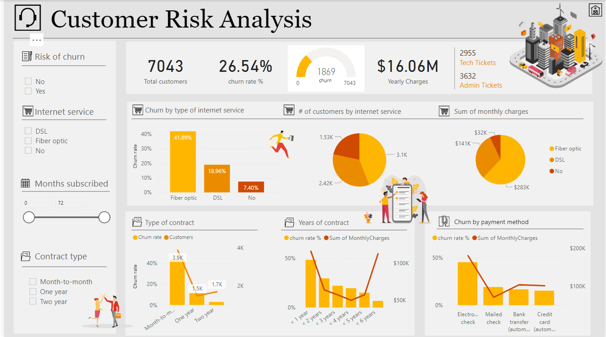

# Risk Analysis Dashboard

## Author

- [Shubham](shubhamjethva92@gmail.com) - _(Maintainer)_

## Prerequisites

- PowerBI: Install the latest version of PowerBI from [here](https://www.microsoft.com/en-us/power-platform/products/power-bi/downloads)
- SQL: Install the latest version of SQL from [here](https://www.mysql.com/downloads/)

## Application Overview

The Risk Analytics Dashboard is an interactive Power BI solution designed to analyze key performance indicators (KPIs) and streamline risk assessment. By leveraging DAX queries for advanced analytics, the dashboard enhances business insights and improves decision-making efficiency. The integration of REST APIs and SQL databases ensures seamless real-time data flow, enabling users to monitor risks dynamically. This system has successfully reduced reporting time by 30%, offering a centralized and data-driven approach to risk evaluation and performance tracking.

## Dashboard:

## Key Tasks
- **Improved Decision-Making:** Provides executives with real-time insights into risk factors, allowing for proactive responses and better strategic planning.
- **Operational Efficiency:** By automating risk analysis and reducing reporting time by 30%, businesses can allocate resources more effectively.
- **Enhanced Compliance & Security:** Ensures data integrity and supports compliance with industry regulations by offering accurate and transparent reporting.
- **Revenue Protection:** Helps detect potential financial and operational risks early, preventing costly disruptions and supporting sustainable business growth.
